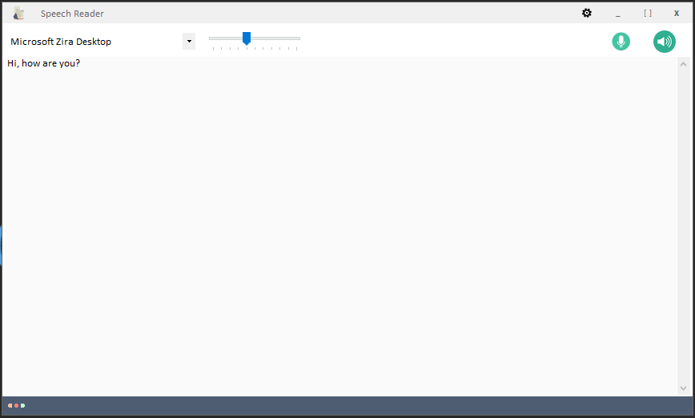
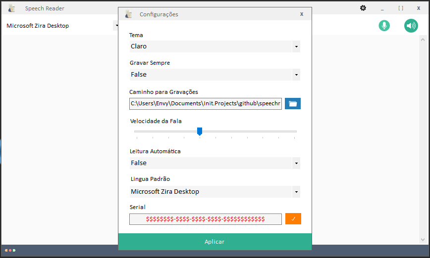
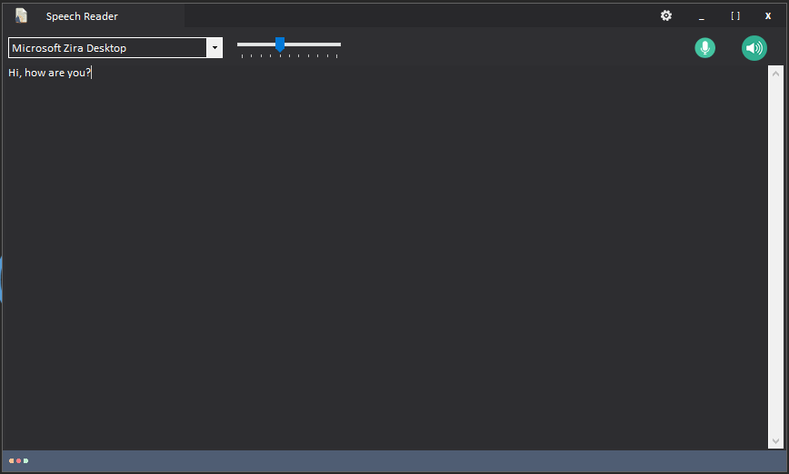
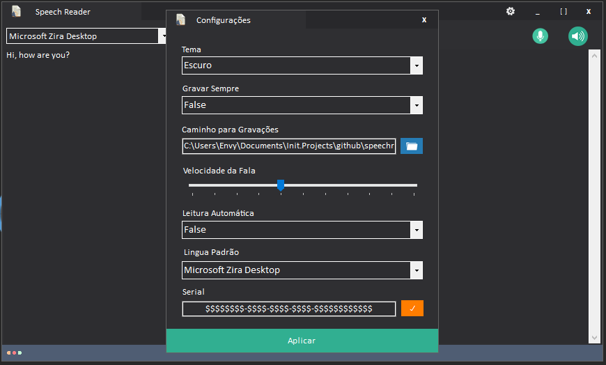

# Speechreader

A C# software that reads text and had the possibility to record everything that is being read.

Here the main screens of the software:

    Main Light Screen

    Settings Light Screen

    Main Dark Screen

    Settings Dark Screen

 
    Thanks a lot for visiting SpeechReader repo 🙂, I hope you enjoyed!!! 👌 
    <h4 style="text-align:center;">Salute 😃</h4> 

 

 
    © 2019, Afonso Matumona Elias

